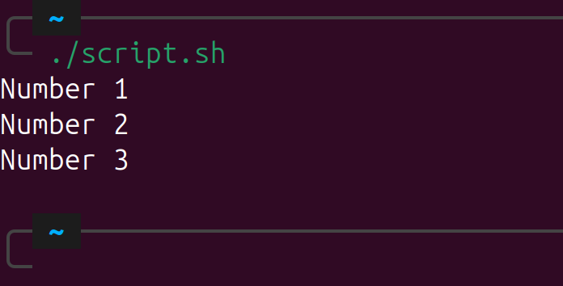

# Linux Shell Scripting Tutorial - By Talha Ayyaz

### Table of Contents

1. [Introduction](#introduction)
2. [Setting Up](#setting-up)
3. [Your First Script](#your-first-script)
4. [Understanding Variables](#understanding-variables)
5. [Making Decisions: if-else](#making-decisions-if-else)
6. [Loops: Doing Things Repeatedly](#loops-doing-things-repeatedly)
7. [Functions: Reusing Code](#functions-reusing-code)
8. [Working with Files](#working-with-files)
9. [Handling Input and Output](#handling-input-and-output)
10. [Tips for Good Scripting](#tips-for-good-scripting)
11. [Mini Projects](#mini-projects)
12. [Conclusion](#conclusion)

---

## Introduction

Shell scripting involves writing a series of commands for the Linux shell to execute. It allows users to interact with their system efficiently by automating tasks and controlling the environment.

<p align="center">
  
</p>

**Benefits of Shell Scripting:**

- Automate repetitive tasks
- Save time and effort
- Control system operations efficiently

---

## Setting Up

- Use a Linux machine or Windows Subsystem for Linux (WSL).
- Open Terminal (shortcut: `Ctrl + Alt + T`).
- Use any text editor:
  - `nano` (simple and beginner-friendly)
  - `vim` (advanced and powerful)
  - VSCode (graphical and user-friendly)

---

## Your First Script

Let's create a simple "Hello World" script.

1. Open a new file:

```bash
vim first_script.sh
```

2. Add the following content:

```bash
#!/bin/bash

# This script prints Hello World
echo "Hello, world!"
```

3. Save and execute:

```bash
chmod +x first_script.sh
./first_script.sh
```

<p align="center">
  
</p>

**Notes:**

- `#!/bin/bash` defines the interpreter.
- `chmod +x` makes the script executable.

---

## Understanding Variables

Variables are used to store data.

```bash
name="Talha"
echo "Hello $name"
```

**Key Points:**

- No spaces around `=`.
- Use `$` to reference variables.
- Always quote variables when using them.

---

## Making Decisions: if-else

Conditional execution is crucial.

```bash
name="Talha"

if [ "$name" = "Talha" ]; then
  echo "Welcome, Talha!"
else
  echo "Who are you?"
fi
```

<p align="center">
  
</p>

**Important:**

- Use single `=` for comparison inside `[ ]`.
- Always quote variables.

---

## Loops: Doing Things Repeatedly

Loops help in repeating tasks.

**Example 1:**

```bash
for i in 1 2 3
do
  echo "Number $i"
done
```

<p align="center">
  
</p>

**Example 2:**

```bash
for i in {1..5}
do
  echo "Number $i"
done
```

<p align="center">
  
</p>

**Tip:** `{1..5}` generates numbers from 1 to 5.

---

## Functions: Reusing Code

Functions organize code into reusable blocks.

```bash
say_hello() {
  echo "Hello, $1!"
}

say_hello Talha
say_hello World
```

<p align="center">
  
</p>

**Note:** `$1` refers to the first argument passed to the function.

---

## Working with Files

Check file existence easily:

```bash
if [ -f myfile.txt ]; then
  echo "File exists."
else
  echo "File not found."
fi
```

<p align="center">
  
</p>

**Useful Commands:**

- `touch file.txt` to create a file.
- `rm file.txt` to delete a file.

---

## Handling Input and Output

**Reading user input:**

```bash
echo "Enter your name:"
read username
echo "Hello $username"
```

**Redirecting output to a file:**

```bash
echo "Some text" > output.txt
```

<p align="center">
  
</p>

**Tips:**

- `>` overwrites the file.
- `>>` appends to the file.

---

## Tips for Good Scripting

- Always start scripts with `#!/bin/bash`.
- Use comments (`#`) to explain sections.
- Keep scripts clean and modular.
- Test scripts incrementally.
- Handle errors gracefully.

**Additional Tip:**

- Use `set -e` to make the script exit immediately if any command fails.

---

## Mini Projects

Practice your skills with these ideas:

- **Backup Script:** Copy files from the Documents directory to a backup folder.
- **Cleaner Script:** Delete `.tmp` files older than seven days.
- **Greeting Bot:** Ask the user's name and greet them accordingly.

---

## Conclusion

Shell scripting is a powerful tool to automate, manage, and control Linux systems efficiently. By mastering scripting basics like variables, loops, functions, and file operations, you can create robust solutions for everyday tasks.
